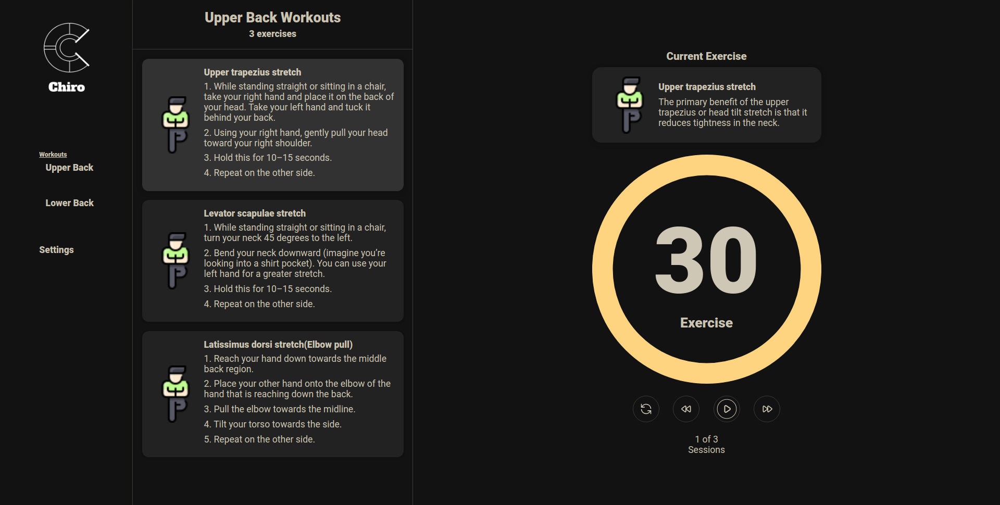
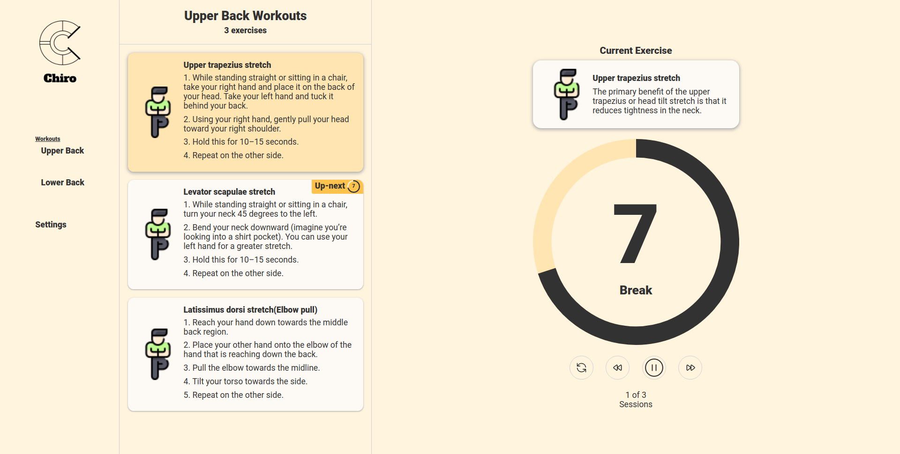
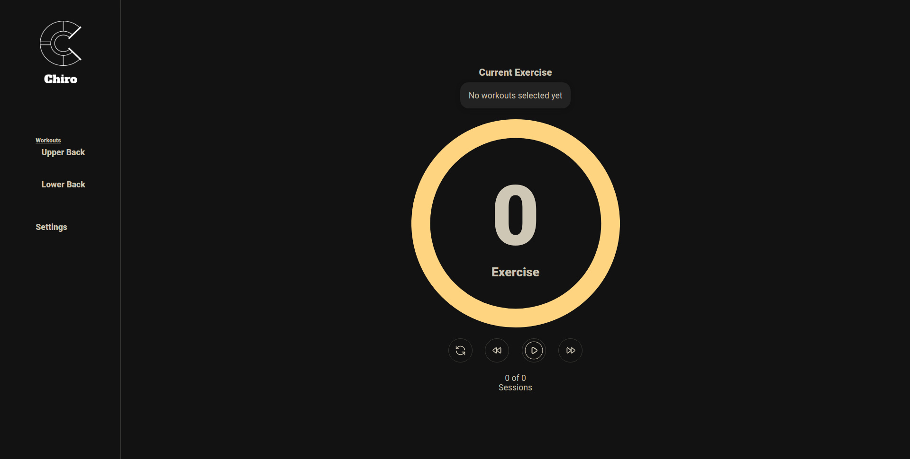
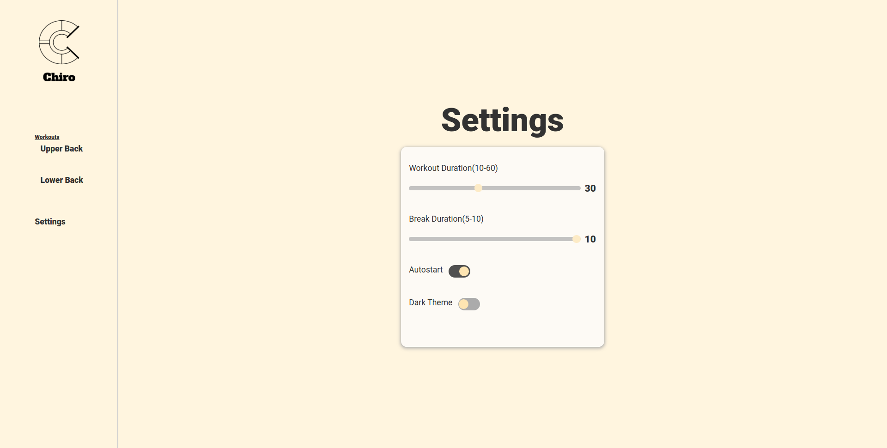

# Chiro

## Stretching Exercise Web App

<div class="row">
  
  
</div>
<div class="row">
  
  
</div>

## What Is The Use (Person I Don't Know)? 

Well, if you work sitting down for long hours or sleep the wrong way, at some point, you may feel pain or discomfort in some areas of your body. By default, your body needs movement throughout the day to compensate for all the sitting and sleeping you do. Hence, this web app will give you useful exercises and workout sessions to help you avoid some of the pitfalls that come with it.

```
--Disclaimer--
The exercise program and instructions in this web app are NOT intended, and
 should NOT be used, as a substitute for professional medical advice,
  diagnosis, or treatment. Not all exercises are suitable for everyone and this
   or any other exercise program may result in injury. PLEASE ALWAYS consult 
   your DOCTOR before beginning this or any other exercise programs.
```

## Features

- Session Based exercise routines with a count-down timer 
- Auto start workouts and breaks timer for hands-free stretch exercise
- Simple settings controls to adapt **`Chiro`** to suit your needs
- &#127766; Dark mode

## Stack
Chiro front-end is built with React,  Redux-toolkit, React-Router, Emotion, and a 7-year-old &#x1F4BB;

## Browser Support
Firefox, Chrome, Edge, Safari, and IE(just kidding) are supported

## TODO
- [ ] Get more workouts from server
- [ ] `Save stats`(total weekly, monthly progress per body area)
- [ ] Add blog/tips page
- [ ] Notification
- [ ] Testing
- [ ] Documentation


<style>
  .row{
    display: flex;
    gap: 1.3rem;
    margin: 1.3rem 0;   
   }
  .image {
    box-shadow: 0 4px 8px 0 rgba(0, 0, 0, 0.2), 0 6px 20px 0 rgba(0, 0, 0, 0.7);border-radius:3px;
    flex: 1 1 50%;
    width: 45%;
  }
</style>
